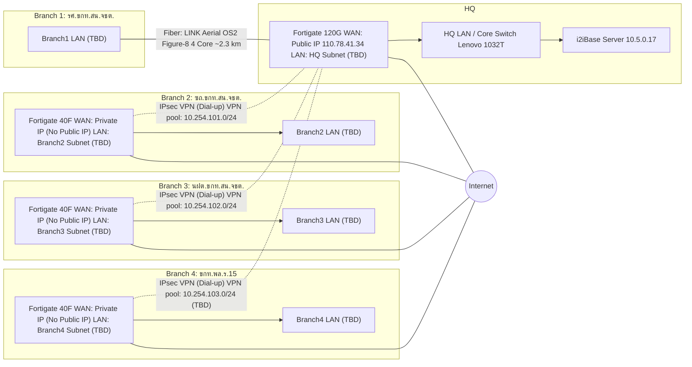

# การเชื่อมต่อระบบเครือข่าย HQ – Branch เพื่อให้บริการระบบ i2iBase

เอกสารฉบับนี้สรุป **รายชื่ออุปกรณ์**, **การเชื่อมต่อระหว่างสาขา**, และ **แนวทางการตั้งค่า** สำหรับการเชื่อมต่อ HQ ไปยัง 4 สาขา เพื่อให้เข้าถึงบริการ i2iBase ที่ HQ ได้อย่างปลอดภัย

> หมายเหตุ: ข้อมูล IP/Subnet/พอร์ต/อุปกรณ์ปลายทางของสาย Fiber ยังไม่ได้ระบุในโจทย์ จึงทำเป็นช่อง **(TBD)** เพื่อให้เติมหลังสำรวจหน้างาน

## 1) รายชื่อสาขา (Sites)

-   HQ (สำนักงานใหญ่): มี Public IP, ใช้ Fortigate 120G
-   สาขา 1: รศ.ขกท.สน.จชต.
-   สาขา 2: ซถ.ขกท.สน.จชต.
-   สาขา 3: นฝต.ขกท.สน.จชต.
-   สาขา 4: ขกท.พล.ร.15

## 2) รายชื่ออุปกรณ์ (Inventory)

### 2.1 อุปกรณ์หลัก (Firewall/Router)

| Site     | อุปกรณ์หลัก    | บทบาท                                     | Public IP | หมายเหตุ                     |
| -------- | -------------- | ----------------------------------------- | --------- | ---------------------------- |
| HQ       | Fortigate 120G | VPN Hub / Internet Edge / Security Policy | มี        | Public IP: 110.78.41.34      |
| Branch 2 | Fortigate 40F  | VPN Spoke / NAT / Policy                  | ไม่มี     | ได้ IP จาก ISP/Private (TBD) |
| Branch 3 | Fortigate 40F  | VPN Spoke / NAT / Policy                  | ไม่มี     | ได้ IP จาก ISP/Private (TBD) |
| Branch 4 | Fortigate 40F  | VPN Spoke / NAT / Policy                  | ไม่มี     | ได้ IP จาก ISP/Private       |

### 2.2 โครงข่ายระหว่าง HQ ↔ Branch 1 (Fiber)

| รายการ              | รายละเอียด                                                                                |
| ------------------- | ----------------------------------------------------------------------------------------- |
| Cable               | LINK Aerial OS2 Figure-8 4 Core                                                           |
| Distance            | ~2.3 km                                                                                   |
| ปลายทาง A           | HQ (ตู้/จุดติดตั้ง): (TBD)                                                                |
| ปลายทาง B           | Branch 1 (ตู้/จุดติดตั้ง): (TBD)                                                          |
| การใช้งาน Core      | ใช้งาน 2 Core (Tx/Rx) / สำรอง 2 Core (แนะนำ) _(ยืนยันตามหน้างาน)_                         |
| Transceiver / Media | SFP/Media Converter/สวิตช์ที่รองรับ Single-mode OS2 (HQ: Core Switch Lenovo 1032T): (TBD) |

ชุดอุปกรณ์ปลายทางไฟเบอร์ (ให้ใช้ทั้งฝั่ง HQ และฝั่ง Branch 1):

Aerial Fiber (บนเสาไฟฟ้า)
↓
Splice Closure (Outdoor)
↓
Fiber Pigtail (LC)
↓
Patch Panel/ODF (ในตู้)
↓
Patch Cord (LC-LC)
↓
SFP / Media Converter / Firewall

> หาก Branch 1 ไม่มี Fortigate ระบุไว้ในโจทย์: ให้ยืนยันว่า Branch 1 ต่อเข้า Fortigate ที่ HQ โดยตรง (L2/L3) หรือมี Firewall/Router ที่ Branch 1 เพิ่มเติม

### 2.3 การสำรวจราคาอุปกรณ์รายชิ้น (Price Survey / BoM)

วัตถุประสงค์: จัดทำรายการอุปกรณ์ **รายชิ้น** แยกตามสาขา เพื่อใช้สำรวจราคา/ขอใบเสนอราคา/สรุปงบประมาณ

แนวทางการสำรวจราคา (แนะนำ):

-   ขอใบเสนอราคาอย่างน้อย 2–3 ผู้ขาย/แหล่งราคา
-   เปรียบเทียบเงื่อนไข: ระยะเวลาส่งมอบ (Lead time), ประกัน (Warranty), บริการหลังการขาย/Support, รวม/ไม่รวม VAT, รวม/ไม่รวมค่าขนส่ง
-   ระบุวันที่ราคาและแนบไฟล์ใบเสนอราคา (PDF/รูป/ลิงก์) เพื่ออ้างอิง

#### 2.3.1 ตารางสำรวจราคา (แยกตามสาขา)

> ช่องราคาใส่เป็น (TBD) จนกว่าจะได้ใบเสนอราคา

หมายเหตุ HQ: มีอุปกรณ์หลักอยู่แล้ว **ยกเว้น** หัว SFP และ Patch panel (สำหรับต่อผ่าน Core Switch Lenovo 1032T)

> หมายเหตุการสำรวจราคา: ดึงตัวอย่างราคาจาก Lazada Thailand (Marketplace) และเลือกตัวอย่างที่แสดงจังหวัดในไทยในหน้ารายการสินค้า/ค้นหา ทั้งนี้ควรตรวจสอบ “ส่งจาก/ใบกำกับภาษี/VAT/ค่าจัดส่ง/เงื่อนไขประกัน” ก่อนสั่งซื้อจริง

| Site     | รายการ                                        |                                                             รุ่น/สเปก | จำนวน | หน่วย   | ราคา/หน่วย (บาท) | ราคารวม (บาท) | ผู้ขาย/แหล่งราคา                                               | วันที่ราคา | หมายเหตุ                                                            |
| -------- | --------------------------------------------- | --------------------------------------------------------------------: | ----: | ------- | ---------------: | ------------: | -------------------------------------------------------------- | ---------- | ------------------------------------------------------------------- |
| HQ       | Firewall                                      |                                                        Fortigate 120G |     1 | เครื่อง |       มีอยู่แล้ว |             0 | -                                                              | -          | อุปกรณ์เดิม HQ                                                      |
| HQ       | Core Switch                                   |                                                          Lenovo 1032T |     1 | เครื่อง |       มีอยู่แล้ว |             0 | -                                                              | -          | อุปกรณ์เดิม HQ                                                      |
| HQ       | SFP (หัว SFP) สำหรับ Lenovo 1032T             |                      Reyee MINI-GBIC-LX-SM1310 (1G LX, LC, SMF, 10km) |     2 | ชิ้น    |         1,260.00 |      2,520.00 | Lazada: https://www.lazada.co.th/products/pdp-i5281114919.html | 2026-01-06 | ต้องยืนยันความเข้ากันได้กับ Lenovo 1032T                            |
| HQ       | SFP (หัว SFP) สำหรับ Lenovo 1032T             |                                  Link UT-901G-LC20 (SFP SM, LC, 20km) |     2 | ชิ้น    |         1,350.00 |      2,700.00 | Lazada: https://www.lazada.co.th/products/pdp-i2754975942.html | 2026-01-06 | ตัวเลือกสำรอง; ยืนยันความเข้ากันได้                                 |
| HQ       | Patch panel / ODF (สำหรับต่อผ่าน Core Switch) | ODF Rack Mount 1U 19" 12/24 Core + Splice Tray 24 Core (2 ชั้น 12+12) |     1 | ชุด     |           837.00 |        837.00 | Lazada: https://www.lazada.co.th/products/pdp-i1847208694.html | 2026-01-06 | เลือกชนิดหัว/อะแดปเตอร์ (LC/SC) ให้ตรงกับ SFP/พิกเทล                |
| HQ       | Patch panel / ODF (สำหรับต่อผ่าน Core Switch) |   ODF Rack Mount 12/24 Core Optical Fiber Patch Panel 1U (กล่องเปล่า) |     1 | ชุด     |           369.68 |        369.68 | Lazada: https://www.lazada.co.th/products/pdp-i976428336.html  | 2026-01-06 | ราคาถูกกว่า แต่อาจต้องซื้ออุปกรณ์ประกอบเพิ่ม (Adapter/Pigtail/Tray) |
| HQ       | Splice Closure (Outdoor)                      |                                                                 (TBD) |     1 | ชุด     |            (TBD) |         (TBD) | (TBD)                                                          | (TBD)      | สำหรับจุดต่อสาย Aerial → Pigtail เข้าตู้                            |
| HQ       | Fiber Pigtail (LC, Single-mode)               |                                                                 (TBD) |     2 | เส้น    |            (TBD) |         (TBD) | (TBD)                                                          | (TBD)      | ตามจำนวน core ที่ใช้งาน (Tx/Rx)                                     |
| HQ       | Patch Cord (LC-LC, Single-mode)               |                                                                 (TBD) |     2 | เส้น    |            (TBD) |         (TBD) | (TBD)                                                          | (TBD)      | ต่อจาก ODF ไปยัง SFP/อุปกรณ์                                        |
| HQ       | Rack/UPS/อุปกรณ์ประกอบ                        |                                                                 (TBD) | (TBD) | ชุด     |       มีอยู่แล้ว |             0 | -                                                              | -          | อุปกรณ์เดิม HQ (ถ้ามี)                                              |
| Branch 1 | Fiber Cable                                   |                                       LINK Aerial OS2 Figure-8 4 Core |     2 | km      |       มีอยู่แล้ว |             0 | -                                                              | -          | สาย Aerial Fiber บนเสาไฟฟ้ามีแล้ว                                   |
| Branch 1 | งานเดินสาย/ติดตั้ง                            |                                       เดินสาย + แขวน/ยึด/ร้อย/ป้องกัน |     1 | งาน     |            (TBD) |         (TBD) | (TBD)                                                          | (TBD)      | ผู้รับผิดชอบงาน: ศสท.กอ.รมน ภาค 4 สน.                               |
| Branch 1 | Splicing/Termination                          |                                          เชื่อมต่อ/เข้าหัว/ทดสอบ OTDR |     1 | งาน     |            (TBD) |         (TBD) | (TBD)                                                          | (TBD)      | แนบผลทดสอบ: (TBD)                                                   |
| Branch 1 | Splice Closure (Outdoor)                      |                                                                 (TBD) |     1 | ชุด     |            (TBD) |         (TBD) | (TBD)                                                          | (TBD)      | สำหรับจุดต่อสาย Aerial → Pigtail เข้าตู้                            |
| Branch 1 | Fiber Pigtail (LC, Single-mode)               |                                                                 (TBD) |     2 | เส้น    |            (TBD) |         (TBD) | (TBD)                                                          | (TBD)      | ตามจำนวน core ที่ใช้งาน (Tx/Rx)                                     |
| Branch 1 | ODF/Patch Panel/กล่องจบสาย                    |                                                  Patch Panel/ODF (LC) |     1 | ชุด     |            (TBD) |         (TBD) | (TBD)                                                          | (TBD)      | เลือกจำนวน core/adapter ให้พอใช้งาน+สำรอง (TBD)                     |
| Branch 1 | Patch Cord (LC-LC, Single-mode)               |                                                                 (TBD) |     2 | เส้น    |            (TBD) |         (TBD) | (TBD)                                                          | (TBD)      | ต่อจาก ODF ไปยัง SFP/อุปกรณ์                                        |
| Branch 1 | SFP SM / Media Converter / Firewall (SFP)     |                                                                 (TBD) | (TBD) | ชุด     |            (TBD) |         (TBD) | (TBD)                                                          | (TBD)      | ตามอุปกรณ์ปลายทางจริง                                               |
| Branch 2 | Firewall                                      |                                                         Fortigate 40F |     1 | เครื่อง |            (TBD) |         (TBD) | (TBD)                                                          | (TBD)      | ไม่มี Public IP                                                     |
| Branch 2 | Switch/AP/อุปกรณ์ประกอบ                       |                                                                 (TBD) | (TBD) | ชุด     |            (TBD) |         (TBD) | (TBD)                                                          | (TBD)      | (TBD)                                                               |
| Branch 3 | Firewall                                      |                                                         Fortigate 40F |     1 | เครื่อง |            (TBD) |         (TBD) | (TBD)                                                          | (TBD)      | ไม่มี Public IP                                                     |
| Branch 3 | Switch/AP/อุปกรณ์ประกอบ                       |                                                                 (TBD) | (TBD) | ชุด     |            (TBD) |         (TBD) | (TBD)                                                          | (TBD)      | (TBD)                                                               |
| Branch 4 | Firewall                                      |                                                         Fortigate 40F |     1 | เครื่อง |            (TBD) |         (TBD) | (TBD)                                                          | (TBD)      | ไม่มี Public IP                                                     |
| Branch 4 | Switch/AP/อุปกรณ์ประกอบ                       |                                                                 (TBD) | (TBD) | ชุด     |            (TBD) |         (TBD) | (TBD)                                                          | (TBD)      | (TBD)                                                               |

#### 2.3.2 สรุปราคาแยกตามสาขา (Summary)

| Site           | รวมค่าอุปกรณ์ (บาท) | รวมค่าติดตั้ง/บริการ (บาท) | รวมทั้งสิ้น (บาท) | หมายเหตุ                         |
| -------------- | ------------------: | -------------------------: | ----------------: | -------------------------------- |
| HQ             |               (TBD) |                      (TBD) |             (TBD) | ผู้รับผิดชอบค่าอุปกรณ์: HQ       |
| Branch 1       |               (TBD) |                      (TBD) |             (TBD) | ผู้รับผิดชอบค่าอุปกรณ์: Branch 1 |
| Branch 2       |               (TBD) |                      (TBD) |             (TBD) | ผู้รับผิดชอบค่าอุปกรณ์: Branch 2 |
| Branch 3       |               (TBD) |                      (TBD) |             (TBD) | ผู้รับผิดชอบค่าอุปกรณ์: Branch 3 |
| Branch 4       |               (TBD) |                      (TBD) |             (TBD) | ผู้รับผิดชอบค่าอุปกรณ์: Branch 4 |
| **รวมทั้งหมด** |               (TBD) |                      (TBD) |             (TBD) |                                  |

## 3) Mermaid topology diagram

## 4) การเชื่อมต่อแต่ละสาขา (Connectivity)

### 4.1 HQ (Fortigate 120G + Public IP)

-   หน้าที่หลัก
    -   เป็นจุดออก Internet และเป็นศูนย์กลาง (Hub) สำหรับ VPN จากสาขา
    -   ควบคุม Security Policy และการเข้าถึงระบบ i2iBase
-   การเชื่อมต่อ
    -   WAN: Public IP 110.78.41.34
    -   LAN: เครือข่ายภายใน HQ (TBD)
    -   Link ไป Branch 1: Fiber ~2.3 km (รายละเอียดหัวข้อ 2.2)

### 4.2 Branch 1 (Fiber ~2.3 km)

-   การเชื่อมต่อ
    -   เชื่อมตรงกับ HQ ผ่าน Fiber (อุปกรณ์ปลายทาง/พอร์ต/ความเร็ว: TBD)
-   ข้อควรยืนยันก่อนติดตั้ง
    -   Branch 1 มี Firewall/Router ของตัวเองหรือไม่ (ในโจทย์ไม่ได้ระบุ)
    -   โหมดลิงก์: L2 extension (เช่น VLAN trunk) หรือ L3 point-to-point
    -   การสำรองเส้นทาง: มี/ไม่มี (TBD)

### 4.3 Branch 2 / Branch 3 / Branch 4 (Fortigate 40F ไม่มี Public IP)

-   แนวทางที่เหมาะกับ “ไม่มี Public IP”
    -   ใช้ **IPsec VPN แบบ Dial-up/Spoke-to-Hub** จาก Branch เข้า HQ
    -   รองรับกรณี WAN ของสาขาอยู่หลัง NAT (ใช้ NAT-T)
-   การเชื่อมต่อ
    -   WAN: ได้ IP แบบ Private/Dynamic จาก ISP (TBD)
    -   สร้าง VPN tunnel ไปที่ Public IP ของ HQ

### 4.4 VPN addressing (VPN IP Pools)

กำหนด VPN IP pool แยกต่อสาขา (ตัวอย่างตามข้อมูลที่ให้มา):

-   Branch 2: 10.254.101.0/24
-   Branch 3: 10.254.102.0/24
-   Branch 4: 10.254.103.0/24 (TBD)
-   เพิ่มสาขาในอนาคต: 10.254.104.0/24, 10.254.105.0/24, ...

## 5) แผน IP และ Routing (Template)

> ตารางนี้ทำไว้เป็นแม่แบบเพื่อให้กรอก IP จริงหลังจากยืนยันหน้างาน

| Site     | LAN Subnet | Default GW | DHCP Range | DNS   | หมายเหตุ                                |
| -------- | ---------- | ---------- | ---------- | ----- | --------------------------------------- |
| HQ       | (TBD)      | (TBD)      | (TBD)      | (TBD) | i2iBase อยู่ VLAN/Segment: (TBD)        |
| Branch 1 | (TBD)      | (TBD)      | (TBD)      | (TBD) | ถ้า L3 P2P ให้กำหนด /30 หรือ /31: (TBD) |
| Branch 2 | (TBD)      | (TBD)      | (TBD)      | (TBD) | Advertise route ผ่าน VPN: (TBD)         |
| Branch 3 | (TBD)      | (TBD)      | (TBD)      | (TBD) | Advertise route ผ่าน VPN: (TBD)         |
| Branch 4 | (TBD)      | (TBD)      | (TBD)      | (TBD) | Advertise route ผ่าน VPN: (TBD)         |

### 5.1 Routing หลัก (แนวทาง)

-   HQ ต้องรู้เส้นทางไปยัง LAN ของทุกสาขา (ผ่าน Fiber หรือผ่าน VPN)
-   Branch 2/3/4 ต้องรู้เส้นทางไปยัง HQ LAN และ Service ของ i2iBase ผ่าน VPN
-   แนะนำให้ใช้ Static route (เริ่มต้น) หรือ OSPF/BGP (ถ้าต้องการขยายในอนาคต)

## 6) แนวทางการตั้งค่า (Configuration Checklist)

> เป็นเช็กลิสต์ระดับ “ตั้งค่าให้ใช้งานได้จริง” โดยไม่ผูกกับ CLI เฉพาะรุ่น เพื่อให้อ่านง่ายและนำไปทำงานได้ทันที

### 6.1 HQ: Fortigate 120G (Hub)

-   **WAN/Internet**
    -   ตั้งค่า WAN interface ด้วย Public IP 110.78.41.34
    -   Default route ออก ISP
    -   DNS/NTP (แนะนำใช้ NTP ภายในหรือ NTP ที่อนุญาต)
-   **LAN**
    -   ตั้งค่า interface/VLAN สำหรับ HQ LAN (TBD)
    -   กำหนด DHCP (ถ้ามี) หรือกำหนด static addressing ตามนโยบาย
-   **VPN (Hub)**
    -   สร้าง IPsec VPN แบบรับการเชื่อมต่อจากสาขา (Dial-up)
    -   กำหนด Phase1/Phase2 ให้ตรงกับ Branch (Encryption/Integrity/DH Group/Lifetime)
    -   กำหนด Address objects ของแต่ละ Branch และ HQ
    -   กำหนด Policy ให้สาขาเข้าถึงเฉพาะบริการที่จำเป็น (เช่น i2iBase)
-   **Policy / NAT**
    -   อนุญาต Branch → i2iBase (เฉพาะพอร์ต/ปลายทางที่จำเป็น)
    -   ถ้า Branch ต้องออก Internet ผ่าน HQ: กำหนด policy + NAT เพิ่ม (TBD)
-   **Logging/Monitoring**
    -   เปิด log สำหรับ policy/VPN events
    -   ตั้งค่า backup config ตามรอบเวลา

### 6.2 Branch 2/3/4: Fortigate 40F (Spoke)

-   **WAN/Internet**
    -   ตั้งค่า WAN รับ IP จาก ISP (DHCP/PPPoE/Static: TBD)
    -   เปิด NAT ออก Internet สำหรับผู้ใช้ในสาขา (ถ้าต้องการ)
-   **LAN**
    -   ตั้งค่า LAN interface/subnet ของสาขา (TBD)
    -   DHCP สำหรับเครื่องลูกข่าย (ถ้าต้องการ)
-   **VPN ไป HQ**
    -   ตั้งค่า IPsec VPN ไปที่ Public IP ของ HQ
    -   เปิด NAT-T (กรณีอยู่หลัง NAT)
    -   กำหนด routing: ให้ทราฟฟิกไป HQ/i2iBase วิ่งเข้า tunnel
-   **Security Policy**
    -   อนุญาต LAN → VPN (ไป HQ/i2iBase)
    -   จำกัดปลายทางตามที่จำเป็น

### 6.3 Branch 1: (Fiber)

> เนื่องจากโจทย์ระบุเฉพาะ “สาย Fiber” แต่ไม่ระบุ Firewall ที่ Branch 1 จึงมี 2 แบบที่พบบ่อยให้เลือก

-   **แบบ A: L3 Point-to-Point (แนะนำเมื่อมีการแยก subnet ชัดเจน)**
    -   ตั้งค่า IP ฝั่ง HQ และฝั่ง Branch 1 บนลิงก์ P2P (เช่น /30 หรือ /31)
    -   ใส่ static route/OSPF ตามต้องการ
-   **แบบ B: L2 Extension (Trunk/VLAN)**
    -   ส่ง VLAN ข้ามลิงก์ (ต้องควบคุม STP/Loop ให้ดี)
    -   เหมาะเมื่ออยากให้ Branch 1 อยู่ใน VLAN เดียวกับ HQ (ต้องประเมินความเสี่ยง/ผลกระทบ)

## 7) ผู้รับผิดชอบ (Roles & Responsibilities)

### 7.1 ความรับผิดชอบด้านค่าอุปกรณ์

ค่าอุปกรณ์ของแต่ละสาขาให้เป็นความรับผิดชอบของสาขานั้น ๆ

-   HQ: รับผิดชอบค่าอุปกรณ์ของ HQ
-   Branch 1 (รศ.ขกท.สน.จชต.): รับผิดชอบค่าอุปกรณ์ของสาขา 1
-   Branch 2 (ซถ.ขกท.สน.จชต.): รับผิดชอบค่าอุปกรณ์ของสาขา 2
-   Branch 3 (นฝต.ขกท.สน.จชต.): รับผิดชอบค่าอุปกรณ์ของสาขา 3
-   Branch 4 (ขกท.พล.ร.15): รับผิดชอบค่าอุปกรณ์ของสาขา 4

### 7.2 ตารางผู้รับผิดชอบงานหลัก

| รายการงาน                                               | ผู้รับผิดชอบ         | ขอบเขต/หมายเหตุ                                                             |
| ------------------------------------------------------- | -------------------- | --------------------------------------------------------------------------- |
| การเดินสาย Fiber (HQ ↔ Branch 1)                        | ศสท.กอ.รมน ภาค 4 สน. | รวมงานเดินสาย/ทดสอบลิงก์/จัดส่งผลทดสอบ (TBD ตามหน้างาน)                     |
| การตั้งค่าเครือข่าย และการอนุมัติ User สำหรับระบบ iBase | ผคซ.ศฐม.จชต.         | ครอบคลุม Policy/Route/VPN ที่เกี่ยวกับการเข้าถึง i2iBase และการจัดการผู้ใช้ |
| การอนุมัติข้อมูล                                        | ผสข.ศฐม.จชต.         | การอนุมัติข้อมูลในกระบวนการของระบบ i2iBase ตามสิทธิ์ที่กำหนด                |

## 8) Checklist ก่อนส่งมอบงาน

-   สำรวจราคาอุปกรณ์รายชิ้น (BoM) และสรุปราคารวมต่อสาขา (อ้างอิงหัวข้อ 2.3)
-   ยืนยันข้อมูล: WAN type ของ Branch 2/3/4, อุปกรณ์ปลายทางของ Fiber, และรุ่นอุปกรณ์ของ Branch 4
-   กำหนด IP Plan (HQ/Branch1/Branch2/Branch3/Branch4) ให้ไม่ชนกัน
-   ทดสอบการเชื่อมต่อ
    -   Ping/Traceroute HQ ↔ ทุกสาขา
    -   ทดสอบเข้าถึงบริการ i2iBase จากทุกสาขา
    -   ทดสอบ VPN fail/reconnect (Branch 2/3/4)
-   ยืนยันผู้รับผิดชอบ/การอนุมัติ
    -   ผู้รับผิดชอบงานเดินสาย Fiber: ศสท.กอ.รมน ภาค 4 สน.
    -   ผู้รับผิดชอบการตั้งค่าเครือข่าย + อนุมัติ User iBase: ผคซ.ศฐม.จชต.
    -   ผู้รับผิดชอบการอนุมัติข้อมูล: ผสข.ศฐม.จชต.
-   จัดทำไฟล์ Backup config และบันทึกค่าที่ตั้งไว้ (Credential/PSK เก็บในที่ปลอดภัย)